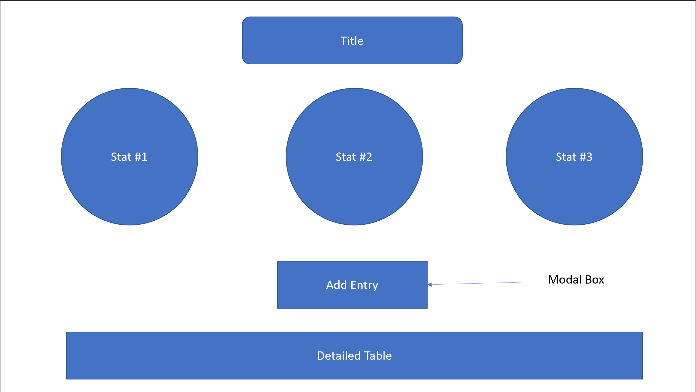

Name: Aditya Kumar

WPI email: akumar6@wpi.edu

Github Username: hellofellowkids

Glitch link: http://a2-hellofellowkids.glitch.me

Assignment 2 - Short Stack: Basic Two-tier Web Application using HTML/CSS/JS and Node.js  

Your application is required to implement the following functionalities:git 
- All pages should [validate](https://validator.w3.org)

3. Test your project to make sure that when someone goes to your main page, it displays correctly.
4. Deploy your project to Glitch, and fill in the appropriate fields in your package.json file.
5. Ensure that your project has the proper naming scheme `a2-yourGithubUsername` so we can find it.
6. Modify the README to the specifications below, and delete all of the instructions originally found in this README.
7. Create and submit a Pull Request to the original repo. Label the pull request as follows: a2-gitusername-firstname-lastname

*Design/UX*
- (5 points per person, with a max of 10 points) Test your user interface with other students in the class. Define a specific task for them to complete (ideally something short that takes <10 minutes), and then use the [think-aloud protocol](https://en.wikipedia.org/wiki/Think_aloud_protocol) to obtain feedback on your design (talk-aloud is also find). Important considerations when designing your study:

1. Make sure you start the study by clearly stating the task that you expect your user to accomplish.
2. You shouldn't provide any verbal instructions on how to use your interface / accomplish the task you give them. Make sure that your interface is clear enough that users can figure it out without any instruction, or provide text instructions from within the interface itself. 
3. If users get stuck to the point where they give up, you can then provde instruction so that the study can continue, but make sure to discuss this in your README. You won't lose any points for this... all feedback is good feedback!

You'll need to use sometype of collaborative software that will enable you both to see the test subject's screen and listen to their voice as they describe their thoughts. After completing each study, briefly (one to two sentences for each question) address the following in your README:

1. Provide the last name of each student you conduct the evaluation with.
2. What problems did the user have with your design?
3. What comments did they make that surprised you?
4. What would you change about the interface based on their feedback?

*You do not need to actually make changes based on their feedback*. This acheivement is designed to help gain experience testing user interfaces. If you run two user studies, you should answer two sets of questions.
---

## Simple Survey for College Students
Link: 

This website allows you to fill out and submit a simple survey by clicking the "Take Survey" button. This survey has its responses reported and updated at the bottom of the page along with statistics that can shown/hidden by cliking the "Display Stats"/"Hide Stats" button. These stats derive the most popular responses on the survey. The common CSS positoning techniques used is `display:flex` with `align-items: center` and`justify-content: center`.

## Developer Story
The inspiration for the questions were to be simple but mainly to create a divide in opinion. This website started with concept shown in this image: 

The main feature I really wanted to implement were modal boxes, popup boxes that appear with information once you click a button that will prompt a survey to appear. Slowly, this webpage came together by research various techniques from videos, assigned readings, and Stack Overflow. I am also really into survey results and the stats behind them so I wanted to also display those as well. I also used a color scheme using: https://coolors.co/generate .

## Technical Achievements
- **Tech Achievement 1**: Using JS and HTML, I was able to allow users to get consistent updates on the client side of the webpage (both stats and survey responses) after a new entry was submitted. A minor additional feature is when they go submit another survey, it does not store the previous submission data AKA the form's input is reset.

- **Tech Achievement 2**: Using JS, CSS, and HTML, I was able to create modal boxes to host my form. Clicking outside the modal box or hitting the "X" icon of the box, closes modal. The modal is opened when a user decides to take the survey or edit a response. The screen dimming effect along with color combinations allow a clean and effective interface for the user.

- **Tech Achievment 3**: Using JS and HTML, the user is able to modify / delete survey. Modifying is done by clicking on the corresponding response's pencil icon and it opens the modal box's form with inputs based on the selected response's data. Deletion is as simple as clicking corresponding the trash icons. The updates are shown to the client automatically with both of these actions.

### Design/Evaluation Achievements
- **Design Achievement 1**: 